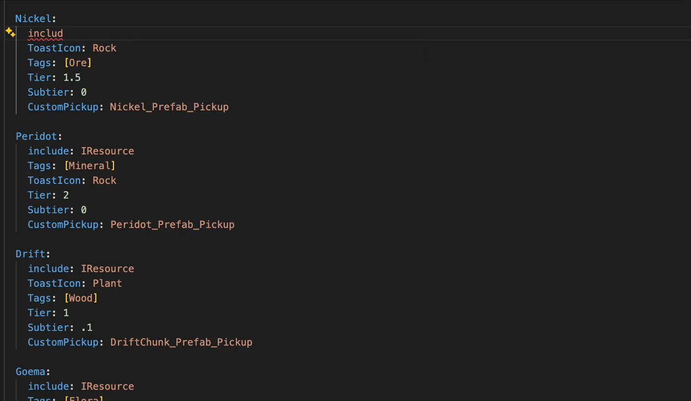
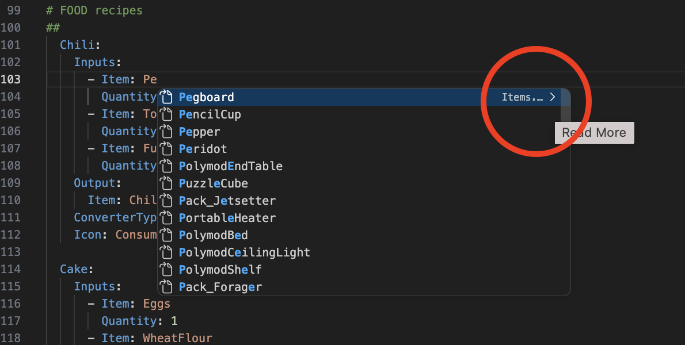
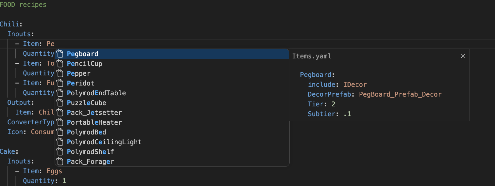

# Ko-op YAML

_developed by jacob_

KO_OP Visual Studio Code extension for config `.yaml` files, which do not natively support cross-file references.


Our config files support:
- reusing content blocks with `include: ITemplateName` or the shorthand `$ITemplateName`
- referencing library elements, such as a `Quest`, `Recipe`, or `Shop` specifying an `Item: KeyName` that exists in `iItems.yaml > Elements > KeyName`

This extension adds editing support for these cross-file references:
- **Auto-complete**: suggest all valid entries for the key with an inline preview of the content. Use the arrow keys to quickly cycle between them, and enter to select.
- **Hover**: show an inline preview of the include contents when you hover a name
- **Go-to-definition**: jump to file and line where the name is defined (`Ctrl/Cmd + Click`)

## Instructions

1. Install the plug-in
ask jacob
@jacob TODO

2. Open a `.yaml` file in `Configs/` (or any sub-directory thereof)

3. 🚨 **Important**: to get the full use of autocomplete and see content previews, you MUST **manually** click on the > in the far right of the tooltip at least once.



  |  
|---|---|
❌ Wrong, click the arrow circled            |  ✅ Correct


## Requirements
- Only activates for `.yaml` files in a `Configs/` directory (or sub-directory thereof)
- Expects an optional `Configs/Includes` directory for include lookups
- Expects an optional `Configs/Extension/element_mappings.json` directory for element mappings (see below)

## Features

### Include references (`include:`)

Resolves values of the `include:` key to entries defined in `Configs/Include/*.yaml`.

```yaml
include: SiteDefaults # hover or Ctrl+click to jump to definition
include: [$SiteDefaults, CommonItem] # works with lists too
```

### Element references

Resolves values of recognized element keys (e.g. `Item:`, `Reward:`, `Recipe:`) to named entries in the corresponding source YAML file.

```yaml
Item: EggSandwich            # hover or Ctrl+click → Items.yaml > Elements > EggSandwich
Items: [EggSandwich, Wrench] # works with lists too
Droptable: CommonLoot

Items:                       # mult-line list support
  - EggSandwich
  - Wrench
```

---

## Adding element mappings

Library element key → file mappings are defined in **`Configs/Extension/element_mappings.json`** in our repository, and update in readtime.

Developers can and should freely add to these (and commit them) as they create new config definitions! Some sample mappings:

| YAML Key | Source File |
|---|---|
| `Item(s)` | `Source/Items.yaml` |
| `Items` | `Source/Items.yaml` |
| `Droptable` | `Source/Droptables.yaml` |
| `Locale` | `Source/World/Locales.yaml` |
| `Tableau` | `Source/World/Tableaus.yaml` |
| `SpawnTable` | `Source/World/PrefabSpawnTables.yaml` |
| `Reward` | `Source/Economy/Rewards.yaml` |
| `ConverterTypes` | `Source/Crafting/RecipeConverters.yaml` |
| `ShopItem(s)` | `Source/Economy/ShopItems.yaml` |
| `Recipe` | `Source/Crafting/Recipes.yaml` |

### Format

A flat JSON object mapping YAML key names to file paths relative to the `Configs/` root, using forward slashes:

```json
{
  "Item":      "Source/Items.yaml",
  "Items":     "Source/Items.yaml",
  "Reward":    "Source/Economy/Rewards.yaml",
  "MyNewKey":  "Source/MyNewFile.yaml"
}
```

It could have been a cheeky `.yaml` file itself, but this way makes it clear it's not at all a config file.

### Supported value forms

| YAML form | Example |
|---|---|
| Single value | `Item: EggSandwich` |
| Inline list | `Items: [EggSandwich, Wrench]` |
| Block list | `Items:` followed by `  - EggSandwich` lines |

### Target file format

Element source files must contain a top-level `Elements:` key with two-space-indented child keys:

```yaml
Elements:
  EggSandwich:
    DisplayName: Egg Sandwich
    Weight: 0.3
  Wrench:
    DisplayName: Wrench
    Weight: 1.2
```


## FAQ

### How does this work / how do I make an extension like this?

It's surprisingly simple!

VS Code exposes a **provider** API that lets an extension register handlers for editor actions on specific files - in our case, `.yaml` files in a `Configs/` directory.

Each provider is a class with a single method that VS Code calls when the user triggers the action — you return a result or `undefined` to pass. This extension registers three:

- Jump to Definition: **[`registerDefinitionProvider`](https://code.visualstudio.com/api/references/vscode-api#languages.registerDefinitionProvider)** — called on Ctrl/Cmd+Click (or F12). Return a `Location` pointing at the target file and line.
- Hover/Tooltips: **[`registerHoverProvider`](https://code.visualstudio.com/api/references/vscode-api#languages.registerHoverProvider)** — called when the cursor lingers over text. Return a `Hover` containing a `MarkdownString` to display in the tooltip.
- Auto-complete: **[`registerCompletionItemProvider`](https://code.visualstudio.com/api/references/vscode-api#languages.registerCompletionItemProvider)** — called as the user types. Return an array of `CompletionItem`s, each with a label, detail, and optional documentation shown in the suggestion widget.

All three providers share the same core logic: parse the current line to identify the key and value under the cursor, resolve which source file that key maps to, then read that file to find the matching `Elements:` entry.

The VS Code Extension tutorial is a great starting point, along with the API reference:
- https://code.visualstudio.com/api/get-started/your-first-extension
- https://code.visualstudio.com/api/references/vscode-api


### Why not use the [Language Server Protocol](https://code.visualstudio.com/api/language-extensions/programmatic-language-features#language-features-listing)?

I don't know how.


### Why regex instead of parsing the YAML nodes properly?

We needed to keep editor character positioning and comments for previews; parsing the yaml directly loses all that. Also, this lets us support any syntax that might not be valid YAML.

